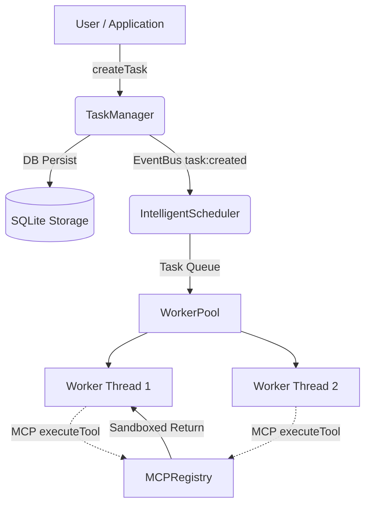

<div align="center">
  <h1>🧠 Cerebria AI Runtime OS</h1>
  <p><strong>A Local-First, Governed, Recoverable Agent Runtime Kernel</strong></p>
  <p><strong>全本地、强监管、带崩溃恢复的生产级大模型运行基座</strong></p>

  
  
  
  
  
</div>

<hr/>

Cerebria is an advanced execution environment designed exclusively for autonomous AI agents. Unlike standard LangChain/AutoGen wrappers, Cerebria acts as a true Operating System Kernel for AI—providing memory paging, background parallel tasks, SQLite-backed crash recovery, and Model Context Protocol (MCP) isolation. 

Cerebria 是专为全自动 AI Agent 打造的进阶运行基座。区别于简单的 LLM 调用封装，Cerebria 的定位是 **AI 专属的操作系统内核**——它不仅提供内存分页管理，更具备并发任务调度池、断电崩溃恢复机制，以及原生的 MCP（模型上下文协议）工具沙箱。

## 🌟 Philosophy (设计哲学)

1. **Agent as a Process (进程自治)**: Agents shouldn't hang when a single API call fails. Cerebria runs Agent tasks in a background memory pool.
2. **Crash Resilience (断电恢复)**: Built-in `TaskManager` persists your agent's thought state to SQLite instantly. If the computer loses power, the agent wakes up right where it left off.
3. **Graceful Teardown (优雅停机)**: Strict OS lifecycle hooks guarantee that pressing `Ctrl+C` flushes memories back to disk securely rather than corrupting active operations.
4. **Governed Isolation (受控自治)**: By leveraging `MCPRegistry`, the runtime prevents hallucinations by treating unhandled logic failures as soft rejections, allowing the LLM to learn and heal.

## 🏗️ Architecture (内核架构)

Cerebria operates exactly like an asynchronous computer OS. The system topology separates the Memory / Storage (TaskManager) from the CPU / Execution threads (IntelligentScheduler & WorkerPool) using an EventBus.



## 🚀 Quick Demo (极速演示)

Boot the OS Kernel and inject a background search task. Notice how `TaskManager` seamlessly routes it to the `WorkerPool`.

```typescript
import Cerebria from 'cerebria';

async function main() {
  // 1. Boot the OS Kernel in persistent mode
  const system = await Cerebria.initializeWithPersistence({
    mode: 'performance',
    dataDir: './data'
  });
  
  // Power on the background scheduler
  await system.scheduler.start();

  // 2. Mount an MCP Compliant Tool
  system.mcpRegistry.registerTool({
    name: 'web_search',
    description: 'Search the internet.',
    inputSchema: {
      type: 'object',
      properties: { query: { type: 'string' } }
    },
    handler: async (args) => {
      return `[Search Results: "${args.query}"]`;
    }
  });

  // 3. Dispatch an Agent Thought Sequence
  await system.taskManager.createTask(
    'Self-Research',
    'Researching the runtime itself',
    {
      priority: 'high',
      callback: async (context) => {
        console.log(`[Worker ${context.workerId}] Executing...`);
        // Simulating LLM calling the MCP Tool securely
        const result = await system.mcpRegistry.executeTool('web_search', { query: 'Cerebria AI' });
        console.log(`[Synthesis] ${result}`);
      }
    }
  );
  
  // Press Ctrl+C at any time, and Cerebria will elegantly shutdown and save state.
}
```

## 📦 Installation (安装)

```bash
npm install cerebria
```

Requirements:
- `Node.js >= 18.0.0`
- TypeScript support enabled (`tsc`)

## 🛡️ License

MIT License. Built for the next era of Autonomous Intelligence.